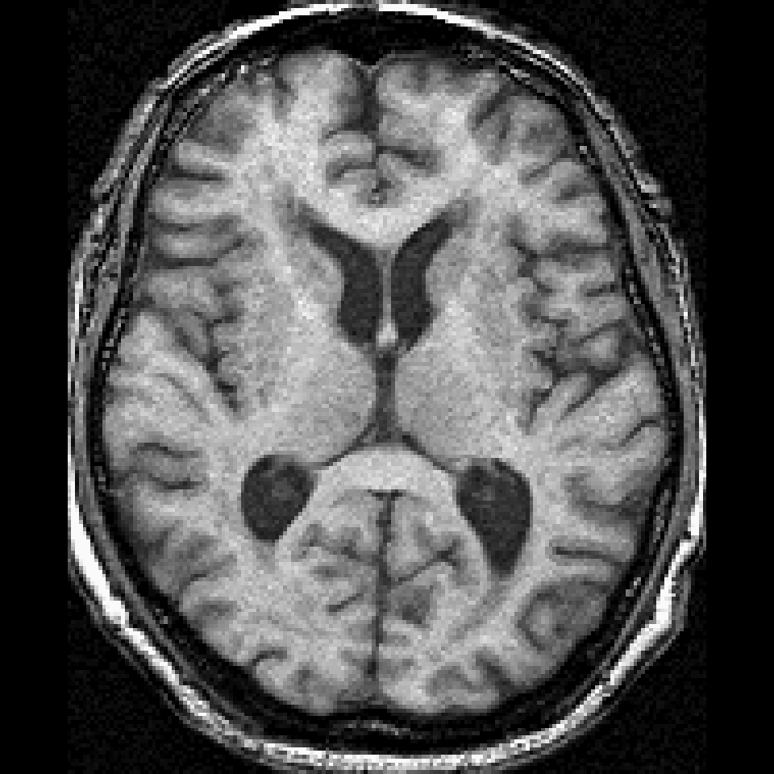
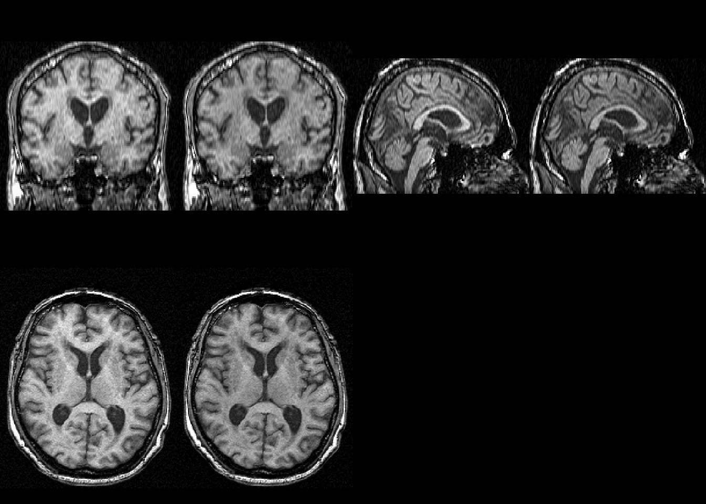

```{r knit-setup, echo=FALSE, results='hide', eval=TRUE, cache = FALSE, warning = FALSE, message = FALSE}
rm( list = ls() )
library(knitr)
library(scales)
library(stringr)
library(plyr)
library(dplyr)
library(fslr)
library(extrantsr)
library(ANTsR)
library(spm12r)

library(fslr)
x = get.fsl()
library(knitcitations)
library(RefManageR)


cleanbib()
options(citation_format = "pandoc")
bib = ReadBib("index.bib", check = TRUE)
opts_chunk$set(cache = TRUE, comment = "", warning = FALSE)
hook1 = function(x){ gsub("```\n*```r*\n*", "", x) }
hook2 = function(x){ gsub("```\n+```\n", "", x) }
knit_hooks$set(document = hook2)
```

## Main Software: fMRI/MRI **Processing**

<div style='font-size: 32pt;'>

- I don't process my data
- MATLAB/SPM
- R
- Python/Nipype
- BrainVoyager/FreeSurfer/AFNI
- Other
- Stata/SAS (just kidding)
</div>

## Main Software: Statistical **Analysis**

<div style='font-size: 35pt;'>

- MATLAB/SPM
- R
- Python/Pandas
- SAS
- Stata/SPSS
- Other/Excel
</div>

## Are these the same?

<div style='font-size: 70pt;'>
- Yes
- No
</div>

## Why R?

<div style='font-size: 25pt;'>

- Statistical tools are state of the art
    - SAS/Stata do not currently support imaging 
- R statistical tools > MATLAB/Python (opinion)
    - maybe not machine learning (scikit-learn)
- Statistics programs commonly teach it
- Packages have been developed for imaging
- Shiny
</div>


## Data used from NITRC

Multi-sequence MRI dataset from Kirby 21 (KKI2009-19):

- Using 2 MRI sequences: **fMRI, MPRAGE**

```{r makefiles, echo=FALSE}
anatomical = "KKI2009-19-MPRAGE.nii.gz"
functional = "KKI2009-19-fMRI.nii.gz"
files = c(anatomical = anatomical,
          functional = functional)
```

```{r showfiles, dependson = "makefiles"}
files
```

- Data from https://www.nitrc.org/projects/multimodal


## oro.nifti (Brandon Whitcher, CRAN)

- Can read/write NIfTI/ANALYZE files
- Implements the `nifti` object (S4)
    - Use it like an array
    - Includes meta data relevant to images
- Has useful plotting functions `image.nifti`, `orthographic`

<div class = "left-half">

</div>
<div class = "right-half">

</div>


## `spm12r` (me, CRAN)
<div style='font-size: 26pt;'>

Requires MATLAB (installs SPM to R library)

- `spm12_slice_timing` - slices are not taken instantaneously
- `spm12_realign` - people move
- `spm12_coregister` - structural imaging is higher resolution
- `spm12_segment` - where's the gray matter?
- `spm12_normalize` - brains look better in MNI
- `spm12_smooth` - turn that noise down
</div>


## fslr (me, CRAN)

- Relies **heavily** on the `nifti` object
- Wraps FSL - a popular neuroimaging suite
    - `fslmaths` - image manipulation
    - `fslstats` - image statistics
    - `fslbet` - brain extraction/skull stripping
- Adds some plotting functionality `ortho2`, `double_ortho`



## `fslr` (me, CRAN)

<div style='font-size: 26pt;'>
- `fsl_slicetimer` - slices are not taken instantaneously
- `mcflirt` - people move
- `flirt` - structural imaging is higher resolution
- `fast` - where's the gray matter?
- `flirt`+`fnirt` - brains look better in MNI
- `fslsmooth` - turn that noise down

</div>


## Basics: The `nifti` object

fslr: `readnii` wraps `oro.nifti::readNIfTI`:

```{r slice_timing_show2, eval = FALSE}
library(fslr)
img = readnii(files["functional"])
print(img)
```

```{r slice_timing_show3, echo = FALSE}
library(fslr)
img = readnii(files["functional"])
print(img)
rm(list="img")
```

## fslr: Slice Timing Correction

`fsl_slicetimer` will do slice timing correction

```{r slice_timing_show, eval = FALSE}
tr = 2 # 2 seconds
first_scan = floor(10.0 / tr) + 1 # 10 seconds "stabilization of signal"
img = subset_4d(img, first_scan:ntim(img))
aimg = fsl_slicetimer(functional, 
                      tr = 2, 
                      indexing = "up",
                      acq_order = "contiguous")
```


```{r slice_timing_run, eval = TRUE, echo = FALSE, results='hide', warning=FALSE, message=FALSE, dependson="slice_timing_run"}
stub = nii.stub(functional)
##################################
# Getting the TR 
##################################
x = paste0(stub, ".par")
l = readLines(x)
tr = l  %>% 
    str_subset("epetition time") %>% 
    str_replace("(.*):(.*)", "\\2")  %>% 
    str_trim %>% 
    as.numeric
tr = tr/1000
tr = round(tr, 3)
filename = functional
afilename = paste0("a", filename)

if (file.exists(afilename)) { 
    # aimg = readnii(afilename)
} else {
  img = readnii(filename)
  # 10 seconds "stabilization of signal"
  first_scan = floor(10.0 / tr) + 1
  img = subset_4d(img, first_scan:ntim(img))
  aimg = fsl_slicetimer(
        img, 
        tr = tr, 
        indexing = "up",
        acq_order = "contiguous",
        outfile = afilename
    )
}
# print(aimg)
rm(list = c("aimg", "img"))
```

## Orthographic View


```{r ortho, message=FALSE, fig.height = 4, fig.width= 6, dependson = "med_img_run", eval = FALSE}
library(fslr); median_image = apply(aimg, c(1, 2, 3), median)
ortho2(median_image)
```


```{r med_img_run, echo = FALSE}
median_image = stat_img(afilename, func = "median")
median_image = robust_window(median_image)
median_image = mask_img(median_image, 
                        median_image > mean(median_image))
median_image = dropEmptyImageDimensions(median_image)
ortho2(median_image)
```

## Image Slice View

```{r image_show, message=FALSE, dependson = "med_img_run"}
image(median_image, z = 18, plot.type = "single")
```


## ANTsR (Brian Avants, GitHub)

Located at https://github.com/stnava/ANTsR

- Re-implements ANTs **within R**
    - Implemented in ITK/C++ (fast)
    - actively maintained (sometimes lacking documentation)
- N3/N4 Inhomogeneity correction
- Registration (Rigid, Affine, Non-linear Diffeomorphic)
- Reads/writes data using pointers (not in memory)
    - not as intuitive/not exactly array-like


## extrantsr ("extra ANTsR", me, GitHub)

Located at https://github.com/muschelli2/extrantsr

- Wraps `ANTsR` functionality
    - Allows `nifti` object use
    - Has `ants2oro` conversion for ANTs images to `nifti`
- Adds commonly done pipelines for neuroimaging
- I use this heavily for my imaging analyses
 


## Motion Correction/Calculation

- `antsMotionCalculation` calculates motion parameters (rp)
  - Also the motion-corrected image 


```{r motion_corr_show, eval = FALSE}
motionCorrectionResults = antsMotionCalculation(boldImage, 
                        fixed = average_image, 
                        moreaccurate = 1,
                        txtype = "Rigid")
```

```{r motion_corr_run, echo = FALSE, message=FALSE, dependson="slice_timing_run"}
stub_filename = afilename
boldImage = check_ants(stub_filename)

avg_img = getAverageOfTimeSeries(boldImage)

#####################
# Full with Half Max twice the vox size
##################
pdim = voxdim(stub_filename)[1]
fwhm = pdim * 2
numberOfTimePoints = fslval(
    file = stub_filename, 
        keyword = "dim4")
numberOfTimePoints = as.numeric(
    numberOfTimePoints)

#####################
# Motion Calculation
##################
stub = nii.stub(stub_filename)
moco_file = paste0(stub, 
    "_Motion_Params.rda")
moco_fname = paste0(stub, "_moco_img.nii.gz")
if (all(file.exists(c(moco_file, 
    moco_fname)))) { 
    load(moco_file)
    moco_img = antsImageRead(moco_fname)
    motionCorrectionResults$moco_img = 
        moco_img
} else {
    motionCorrectionResults = 
    antsMotionCalculation(boldImage, 
        fixed = avg_img, 
        moreaccurate = 1,
        txtype = "Rigid")
    save(motionCorrectionResults, 
        file = moco_file)
    moco_img = 
        motionCorrectionResults$moco_img
    antsImageWrite(moco_img, 
        filename = moco_fname)
}
moco_params = 
    motionCorrectionResults$moco_params
moco_params = moco_params %>% 
    select(starts_with("MOCO"))
nuisanceVariables = moco_params
print(head(moco_params, 3))
```

## Let's Make a Matrix!

`timeseries2matrix` does what the name says
```{r ts_show, echo = TRUE, eval = FALSE}
averageImage = getAverageOfTimeSeries(moco_img)
boldMatrix = timeseries2matrix(img = moco_img, 
    mask = averageImage > mean(averageImage))
DVARS = computeDVARS(boldMatrix)
print(dim(boldMatrix))
```

As you can see, the matrix is $T\times V$, where $V$ are all the voxels in the mask

```{r ts_run, echo = FALSE, dependson="motion_corr_run"}
moco_img = antsImageRead(moco_fname)
averageImage = 
    getAverageOfTimeSeries(moco_img)
maskImage = getMask(averageImage, 
    mean(averageImage), 
    Inf, cleanup = 2)
averageImage[maskImage == 0] = 0
boldMatrix = timeseries2matrix(
    moco_img, 
    maskImage)
DVARS = computeDVARS(boldMatrix)
print(dim(boldMatrix))
```


## DVARS - RMS change in BOLD

`computeDVARS` does what the names says
```{r dvars_show, echo = TRUE, eval = FALSE}
DVARS = computeDVARS(boldMatrix)
fd = motionCorrectionResults$fd

```

```{r dvars_run, echo = FALSE, fig.height = 4, fig.width= 8, dependson="ts_run"}
fd = motionCorrectionResults$fd
mult = 0.25
cDVARS = DVARS/max(DVARS) * mult
plot(cDVARS, type = "l", xlab = "Scan Number", main = "DVARS and Framewise Displacement",
     ylab = "",
     yaxt = "n",
     ylim = c(0, mult*1.4), lwd = 2,
     cex.main = 2,
     cex.lab = 2,
     cex.axis = 1.5)
lines(fd$MaxDisplacement, col = "red", lwd = 2)
lines(fd$MeanDisplacement, col = "blue", lwd = 2)
legend(x = 10, y = mult * 1.4, 
       legend = c("DVARS", "FD-mean", "FD-max"),
       col = c("black", "blue", "red"),
       lwd = 4, horiz = TRUE, cex = 1.2, 
       text.width = 40)
# par(mfrow = c(2, 1))
# 
# plot(DVARS, type = "l", xlab = "Scan Number", main = "DVARS")
# plot(fd$MaxDisplacement, type = "l", xlab = "Scan Number", main = "Framewise Displacement")
# lines(fd$MeanDisplacement, col = "red")
# par(mfrow = c(1,1))
```

## Nuisance Variables

`compcor` implements PCA on high-variance voxels [@behzadi2007component]

- have to specify number of components

```{r ccor_show, eval = FALSE}
compCorNuisanceVariables <- compcor(moco_img, 
  maskImage, 
  ncompcor = 6)
nuisanceVariables <- cbind(moco_params, 
    compCorNuisanceVariables)
```

```{r ccor_run, echo = FALSE, dependson="motion_corr_run"}
ccor_file = paste0(stub, 
    "_CompCor.rda")
if (all(file.exists(ccor_file))) { 
    load(ccor_file)
} else {
    highvar <- compcor(
        moco_img, 
        maskImage, 
        ncompcor = 6, 
        variance_extreme = 0.975,
        returnhighvarmatinds = TRUE)
    compCorNuisanceVariables <- compcor(
        moco_img, 
        maskImage, 
        ncompcor = 6, 
        variance_extreme = 0.975)
    save(compCorNuisanceVariables, 
        highvar,
        file = ccor_file)
}

globalSignal <- rowMeans(boldMatrix)

nuisanceVariables <- cbind(
    # globalSignal = globalSignal,
    moco_params, 
    compCorNuisanceVariables)
nuisanceVariables = scale(nuisanceVariables)
nuisance_mod = lm(boldMatrix ~ nuisanceVariables)
rMatrix <- residuals(nuisance_mod)
```

## Nuisance Regression and Filtering

`lm` works great here for regression $\left(\text{data is }T×V\right)$

```{r nuisance_reg_run, echo = FALSE, eval = TRUE}
boldImage = antsImageRead(moco_fname)
averageImage = getAverageOfTimeSeries(boldImage)
maskImage = getMask(averageImage, 
    mean(averageImage), 
    Inf, cleanup = 2)

nuisanceVariables = scale(nuisanceVariables)
nuisance_mod = lm(boldMatrix ~ nuisanceVariables)
rMatrix <- residuals(nuisance_mod)

rMat1 = rMatrix

rMatrix <- frequencyFilterfMRI(rMatrix, tr = 2, 
    freqLo = 0.01, 
    freqHi = 0.1, 
    opt = "trig")
cleanBoldImage <- matrix2timeseries(
    boldImage, 
    maskImage, 
    rMatrix)
smoothCleanBoldImage = cleanBoldImage * 1
smoothCleanBoldImage = smoothImage(
    cleanBoldImage, 
    sigma = c(rep(fwhm, 3), 0),
    FWHM = TRUE)
rMat2 <- timeseries2matrix(smoothCleanBoldImage, 
    maskImage)
```


```{r nuisance_reg_show, eval = FALSE}
nuisanceVariables = scale(nuisanceVariables)
nuisance_mod = lm(boldMatrix ~ nuisanceVariables)
rMatrix <- residuals(nuisance_mod)
```

```{r nuisance_reg_plot, echo = FALSE, fig.height = 3.5, fig.width= 8, dependson="nuisance_reg_run"}

set.seed(20160409)
n = 5
samp = sample(ncol(rMat1), size = n)
mat = rMat1[, samp]
r = range(mat)
plot(mat[, 1], xlab = "Scan Number", 
     ylab = "fMRI Intensity", main = paste0(n, ' Randomly Selected Voxels'),
     ylim = r, 
     cex.main = 2,
     cex.lab = 1.5,
     cex.axis = 1.25,
     type = "l"
     )
for (i in 2:n) {
  lines(mat[, i], col = i)
}
```

## Filtering the frequencies

- `frequencyFilterfMRI` calls `mFilter::cffilter` to filter the frequencies

```{r filter_show, eval = FALSE}
rMatrix <- frequencyFilterfMRI(rMatrix, tr = 2, 
    freqLo = 0.01, freqHi = 0.1, 
    opt = "trig")
```

```{r filt_nuisance_reg_plot, echo = FALSE, fig.height = 3.5, fig.width= 8, dependson="nuisance_reg_run"}
mat = rMatrix[, samp]
r = range(mat)
plot(mat[, 1], 
     xlab = "Scan Number", 
     ylab = "fMRI Intensity", 
     main = paste0(n, ' Selected Voxels (Filtered)'),
     ylim = r, 
     cex.main = 2,
     cex.lab = 1.5,
     cex.axis = 1.25,
     type = "l"
     )
for (i in 2:n) {
  lines(mat[, i], col = i)
}
```

## Smooth Image 

- `smoothImage` smooths using a Gaussian with FWHM (≈ 2 * Pixel Dimensions) 

```{r smooth_show, eval = FALSE}
cleanBoldImage <- matrix2timeseries(boldImage, 
    maskImage, rMatrix)
smoothCleanBoldImage = smoothImage(cleanBoldImage, 
    sigma = c(rep(6, 3), 0), FWHM = TRUE)
```

```{r smooth_filt_nuisance_reg_plot, echo = FALSE, fig.height = 3.5, fig.width= 8, dependson="nuisance_reg_run"}
mat = rMat2[, samp]
r = range(mat)
plot(mat[, 1], 
     xlab = "Scan Number", 
     ylab = "fMRI Intensity", 
     main = paste0(n, ' Selected Voxels (Smoothed)'),
     ylim = r, 
     cex.main = 2,
     cex.lab = 1.5,
     cex.axis = 1.25,
     type = "l"
     )
for (i in 2:n) {
  lines(mat[, i], col = i)
}
```

# What Else Do We Need?

## Bibliography


