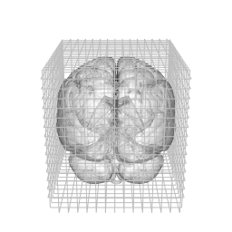
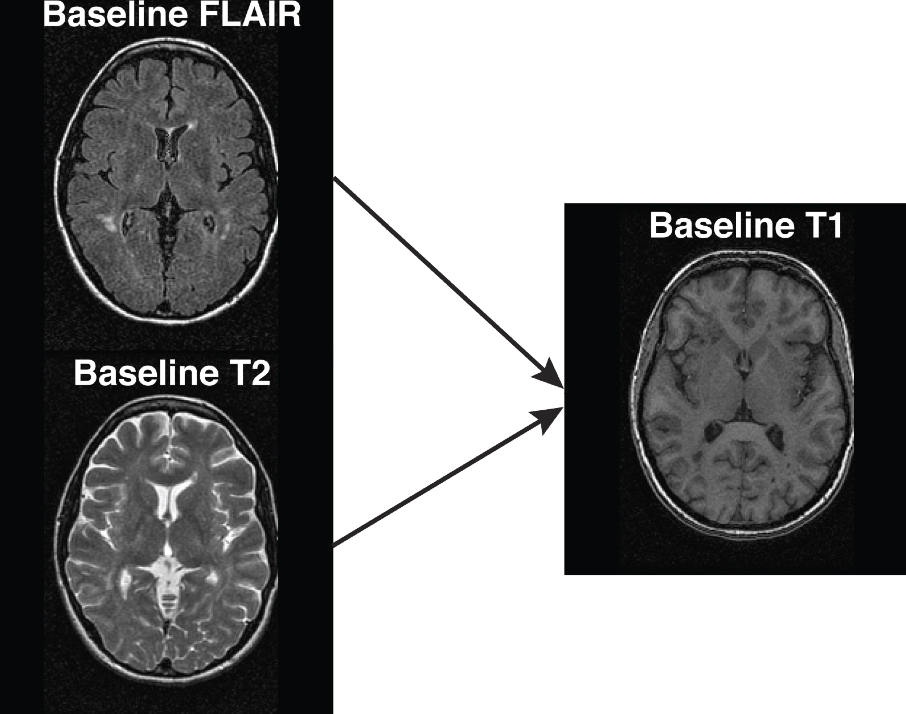

```{r knit-setup, echo=FALSE, results='hide', eval=TRUE, cache = FALSE, warning = FALSE, message = FALSE}
rm( list = ls() )
library(knitr)
library(scales)
library(ANTsR)
library(extrantsr)

options(fsl.path = "/usr/local/fsl/")
options(fsl.outputtype = "NIFTI_GZ")
library(fslr)

library(knitcitations)
library(RefManageR)
cleanbib()
options(citation_format = "pandoc")
bib <- ReadBib("index.bib", check = TRUE)
opts_chunk$set(cache = TRUE, comment = "", warning = FALSE)
hook1 <- function(x){ gsub("```\n*```r*\n*", "", x) }
hook2 <- function(x){ gsub("```\n+```\n", "", x) }
knit_hooks$set(document = hook2)
```

## What can we do in R?

1. Read/Write Images
2. Visualization of Images
3. Inhomogeneity/Bias Field Correction
4. Skull Stripping/Brain Extraction
5. Image Registration
6. Tissue-Class Segmentation
7. Image operations
8. Complex Modeling (yeah - it's R)

## Starting from Raw Data

- `oro.dicom` - read/write DICOM data, the nifti object
    - Pure R implementation
- `dcm2niir` - uses `dcm2nii` from Chris Rorden
    - Can handle Par/Rec and many scanner types
- `matlabr` - could use `dicomread` matlab code and excecute through R


## Introduction: Packages
Medical Imaging Task View

- `oro.nifti`: read/write data, the nifti object
- `fslr`: process data (need FSL for most of the functionality)
- **`ANTsR`: process data (full toolbox)**
- **`extrantsr`: makes ANTsR work with nifti objects**
- `dti` - adaptive smoothing and diffusion tensor tools

- `fmri` - post-processing analysis: linear models and p-value smoothing
- `AnalyzeFMRI` - fMRI analysis (last updated in 2013)
- `spm12r` package calls out MATLAB using SPM 

## Data used from NITRC

Multi-modal dataset from HAMMER, (NIfTI conversion from ANALYZE).  

- Data from https://www.nitrc.org/frs/?group_id=187 (testing folder in White_Matter_Lesion_Segmentation_Testdata.zip)

- 4 MRI sequences: **T1-weighted**, T2-weighted, PD, **FLAIR**

```{r makefiles, echo=FALSE}
files = c(t1 = "T1.nii.gz",
          t2 = "T2.nii.gz",
          pd = "PD.nii.gz",
          flair = "FLAIR.nii.gz")
```

```{r showfiles, dependson = "makefiles"}
files
```


## Basics: Read in the Files!

fslr: `readnii` uses `oro.nifti::readNIfTI`:
```{r read_t1, message=FALSE}
library(fslr)
base_t1 = readnii(files["t1"])
```

- like an array
- ANTsR uses pointers (faster), but not as intuitive

## Orthographic View

```{r ortho, message=FALSE, fig.height = 4, fig.width= 6}
library(fslr)
fslr::ortho2(base_t1)
```

## Orthographic Overlays

```{r ortho_overlay_noalpha, message=FALSE, fig.height = 4, fig.width= 6}
over_50 = mask_img(base_t1, base_t1 > 40); ortho2(base_t1, over_50)
```

## Image Slices

```{r image, message=FALSE}
image(base_t1, z = 55, plot.type = "single")
```


## Slice Overlays

```{r overlay, message=FALSE}
over_50[over_50 <= 0] = NA; over_50 = cal_img(over_50)
overlay(base_t1, over_50, z = 55, plot.type = "single")
```


## Cropped Image Slices

```{r cropped_ortho1, message=FALSE, echo = FALSE, fig.width=5, fig.height=5}
mask = oMask(base_t1)
mask = oMath(mask, "MD", 7)
cropped = dropEmptyImageDimensions(mask, other.imgs = base_t1)$other.imgs
image(cropped, z = floor(dim(cropped)[3]/2), plot.type = "single")
```


## Bias Field Correction

ANTsR/extrantsr 

- `bias_correct` from `extrantsr` package calls `ANTsR::n4BiasFieldCorrection` [@tustison_n4itk_2010]
- EM-like, assumes bias is smooth over space, logs the data

```{r bias_corr}
library(extrantsr)
n4_t1 = bias_correct(file = base_t1, correction = "N4", retimg = TRUE)
```

fslr: Uses method by @sled1998nonparametric (slow)
```{r fsl_bc}
bc_t1 = fsl_biascorrect(file = base_t1)
```

## Bias Field Correction: Results
```{r bias, fig.height = 4, fig.width= 6}
ratio = finite_img(n4_t1 / base_t1)
ortho2(n4_t1, ratio, col.y = alpha(hotmetal(), 0.5))
```


## Skull Stripping: FSL BET `r #citep("smith_fast_2002")`

```{r bet}
ss_t1 = fslbet(n4_t1, outfile = "SS_Image")
```
```{r plotbet, echo=FALSE, dependson = "bet", fig.height = 4, fig.width= 6}
ortho2(ss_t1)
```


## Overlaying Skull Stripped mask

```{r ortho_overlay, message=FALSE, dependson = "bet", fig.height = 4, fig.width= 6}
mask = ss_t1 > 0
ortho2(base_t1, y = mask, col.y = alpha("red", 0.5))
```

## Visualization: Cropped Image Slices

```{r cropped_ortho_overlay, message=FALSE, dependson = "bet", fig.height = 4.5, fig.width= 4.5}
cropped = dropEmptyImageDimensions(ss_t1)
image(cropped, z = floor(dim(cropped)[3]/2), plot.type = "single")
```

## Visualization: 3-dimensions

- `rgl`, `misc3d` (`contour3d` function)
- `brainR` - put on a webpage with some controls

```{r spinning_brain_run, message=FALSE, results='hide', eval = TRUE, echo = FALSE}
if (!all(file.exists("cage.gif", "grid.gif"))) {
  devtools::source_gist("bd40d10afabc503d71e8")
}
```

```{r spinning_brain, message=FALSE, results='hide', eval = FALSE}
devtools::source_gist("bd40d10afabc503d71e8")
```




## Rigid-Body Registration
<div class = "left-half">
ANTsR/extrantsr

- `antsRegistration` - rigid/affine/non-linear diffeomorphic
- `extrantsr::registration` - wraps antsRegistration to use `nifti` objects
</div>
<div class = "right-half">
fslr

- `flirt` - linear/affine registration
- `fnirt` - non-linear registration (need affine first)
- `fnirt_with_affine` - wraps above 2
<div>


## Rigid-Body Registration

- `registration` from `extrantsr` is a general function to do linear/non-linear registration, using `antsRegistration`

```{r reg_flair, include= FALSE}
reg_flair = flirt(infile = files['flair'], reffile = n4_t1, dof = 6)
```

```{r ants_reg, results='hide', message = FALSE}
ants_reg_flair = registration(
  filename = files["flair"], 
  template.file = n4_t1, 
  typeofTransform = "Rigid")
```

```{r write_trans, echo = FALSE, include= FALSE, dependson = "ants_reg"}
output = "reg0GenericAffine.mat"
file.copy(ants_reg_flair$fwdtransforms, output, overwrite = TRUE)
ants_reg_flair$fwdtransforms = output
```




## Rigid-Body Registration Results

```{r double_ortho, echo = FALSE, fig.width=8, fig.height=4}
dd = dropEmptyImageDimensions(n4_t1 > 0,
                              other.imgs = list(n4 = n4_t1, flair = ants_reg_flair$outfile))$other.imgs
dd = lapply(dd, robust_window, probs = c(0, .99))
double_ortho(dd$n4, dd$flair)
```

## Rigid-Body Registration Slice

```{r multi_overlay2, echo = FALSE, fig.width=6, fig.height=4, dependson="double_ortho"}
multi_overlay(dd, z = floor(dim(dd$n4)[3]/2))
```


## Non-linear Registration

- Registering the skull-stripped T1-weighted image to the MNI 152 brain image
- Uses Symmetric Normalization (SyN) [@avants_symmetric_2008]
```{r ants_reg_syn, results='hide', echo = FALSE, message = FALSE}
template.file = mni_fname(mm = "1", brain = TRUE)
template.file = readnii(template.file)
template.mask = gsub("[.]nii", "_mask.nii", mni_fname(mm = "1", brain = TRUE))
template.mask = readnii(template.mask)

template.file = dropEmptyImageDimensions(template.mask, 
                                         other.imgs = template.file)
template.mask = template.file$outimg
template.file = template.file$other.imgs
ss_t1_to_mni = registration(
  filename = ss_t1, 
  template.file = template.file, 
  typeofTransform = "SyN", remove.warp = FALSE,
  outprefix = "temp")
```

```{r ants_reg_syn_show, eval = FALSE, message = FALSE}
template.file = mni_fname(mm = "1", brain = TRUE)
ss_t1_to_mni = registration(
  filename = ss_t1, 
  template.file = template.file, 
  typeofTransform = "SyN", remove.warp = FALSE,
  outprefix = "temp")
```


## Non-linear Registration Results
```{r ants_reg_syn_ers, results='hide', message = FALSE, dependson="ants_reg_syn", fig.width=8, fig.height=6, echo = FALSE}
outfile = mask_img(ss_t1_to_mni$outfile, template.mask)
double_ortho(template.file, outfile)
```


## Applying Registration Transformations

```{r applying_trans, results='hide', message = FALSE, dependson="ants_reg_syn", echo = FALSE}
flair = mask_img(ants_reg_flair$outfile, ss_t1 > 0)
reg_flair_to_mni = ants_apply_transforms(
  fixed = template.file, 
  moving = flair, # registered FLAIR
  interpolator = "Linear",
  transformlist = ss_t1_to_mni$fwdtransforms )
```

```{r applying_trans_show, results='hide', message = FALSE, eval = FALSE}
reg_flair_to_mni = ants_apply_transforms(
  fixed = template.file, 
  moving = ants_reg_flair$outfile, # registered FLAIR
  interpolator = "Linear",
  transformlist = ss_t1_to_mni$fwdtransforms )
```

## Non-linear Transformation of FLAIR
```{r ants_reg_syn_res_flair, results='hide', message = FALSE, dependson="applying_trans", fig.width=8, fig.height=4, echo = FALSE}
double_ortho(template.file, reg_flair_to_mni, xyz = floor(dim(template.file)/2) + c(-2, -5, 0))
```

## Preprocess MRI: within a visit

We can develop pipelines/full analyses!

`extrantsr::preprocess_mri_within` will do inhomogeneity correction, skull strip (or mask), and register to the first scan.

```{r preproc_within, eval=FALSE, dependson = c("makefiles", "bet")}
proc_images = preprocess_mri_within(
  files = files[c("t1", "t2", "pd", "flair")], 
  maskfile = ss_t1 > 0)
```

## Preprocess MRI: across visits

`preprocess_mri_across` combines `preprocess_mri_within` and `registration`.  If you had baseline/follow-up data:
```{r preproc_across, eval=FALSE}
outfiles = gsub("[.]nii", '_process.nii', files)
preprocess_mri_across(
  baseline_files = files[c("base_t1", "base_t2", "base_pd", "base_flair")],
  followup_files = files[c("f_t1", "f_t2", "f_pd", "f_flair")],
  baseline_outfiles = outfiles[c("base_t1", "base_t2", "base_pd", "base_flair")],
  followup_outfiles = outfiles[c("f_t1", "f_t2", "f_pd", "f_flair")],
  maskfile = "Brain_Mask.nii.gz")
```


## Tissue-Class Segmentation
<div class = "col2">
ANTsR/extrantsr: uses Atropos [@atropos]

- `ANTsR` - `atropos`, `extrantsr` - `otropos` 
```{r otropos}
tissue_seg = otropos(
  a = ss_t1,
  x = mask)
```

fslr: uses FAST [@zhang2001segmentation]

- `--nobias` as an option does not do bias field correction
```{r fast}
fast_t1 = fast(ss_t1, opts = "--nobias")
```

See alos `spm12r_segment`

<div>

## ANTsR Tissue-Class Segmentation 

```{r ortho2_tissue, echo = FALSE, fig.width =7, fig.height=5}
dd = dropEmptyImageDimensions(
  ss_t1 > 0, 
  other.imgs = list(ss = ss_t1, seg = tissue_seg$segmentation))
dd = dd$other.imgs
dd$ss = robust_window(dd$ss, probs = c(0, .99))
ortho2(dd$ss, dd$seg, col.y = alpha(hotmetal(), 0.5))
```

## ANTsR Tissue-Class Segmentation 

```{r double_ortho_tissue, echo = FALSE, fig.width=8, fig.height=4, dependson = "ortho2_tissue"}
double_ortho(dd$ss, dd$seg)
```

## fslr Tissue-Class Segmentation 

```{r fslr_double_ortho_tissue, echo = FALSE, fig.width=8, fig.height=4}
dd = dropEmptyImageDimensions(
  ss_t1 > 0, 
  other.imgs = list(ss = ss_t1, seg = fast_t1))
dd = dd$other.imgs
dd$ss = robust_window(dd$ss, probs = c(0, .99))
double_ortho(dd$ss, dd$seg)
```


## Image operations
<div class = "left-half">
fslr

- `fslsmooth` - Gaussian/box smoothing
- `fslerode/fsldilate` - erosion/dilation
- `fslfill/fslfill2` - fill holes 

spm12r

- `spm_bwlabel` - label connected components
</div>
<div class = "right-half">
ANTsR

- `smooth_image` - Gaussian smoothing
- `oMath("ME")/oMath("MD")` - erosion/dilation
- `oMath("FillHoles")` - fill holes
- `oMath("GetLargestComponent")` - find largest components
</div>


## fMRI 
- `fsl_slicetimer` - slice timing correction
- `ANTsR::preprocessfMRI` 
- `spm12r` 
    - slice timing correction
    - realignment - get motion correction parameters
    - co-registration
    - segmentation/normalization to a template


## Intensity Normalization

- WhiteStripe [@shinohara_statistical_2014]
- Whole brain z-scoring 
- Histogram matching 
- General standardization methods 
 
## Overview

- Many methods are being developed for processing neuroimaging in R
- Analysis tools are largely already in R
- These are not standardized nor centralized
- Develop something like BioConductor
    - standard data structures
    - standard data sets
    - NITRC isn't exactly what we want
- GitHub and Neuroconductor

## Interactive Visualization using papayar


<div class="papaya" data-params="params"></div>

## Bibliography


